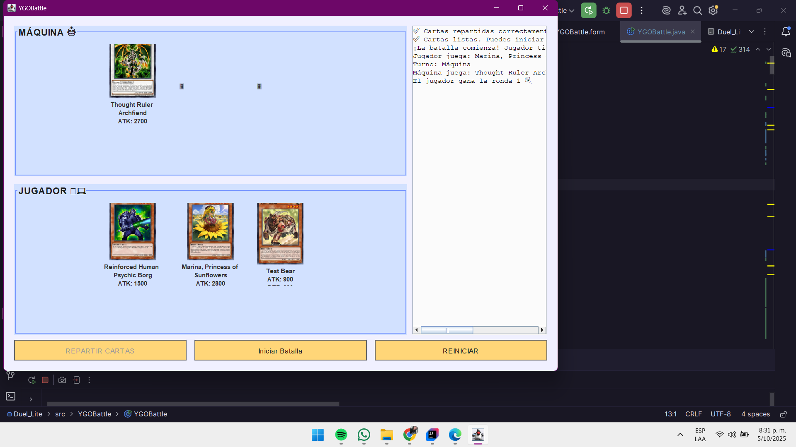
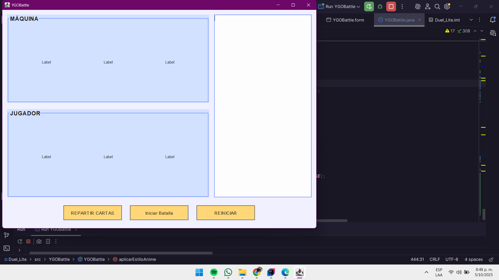
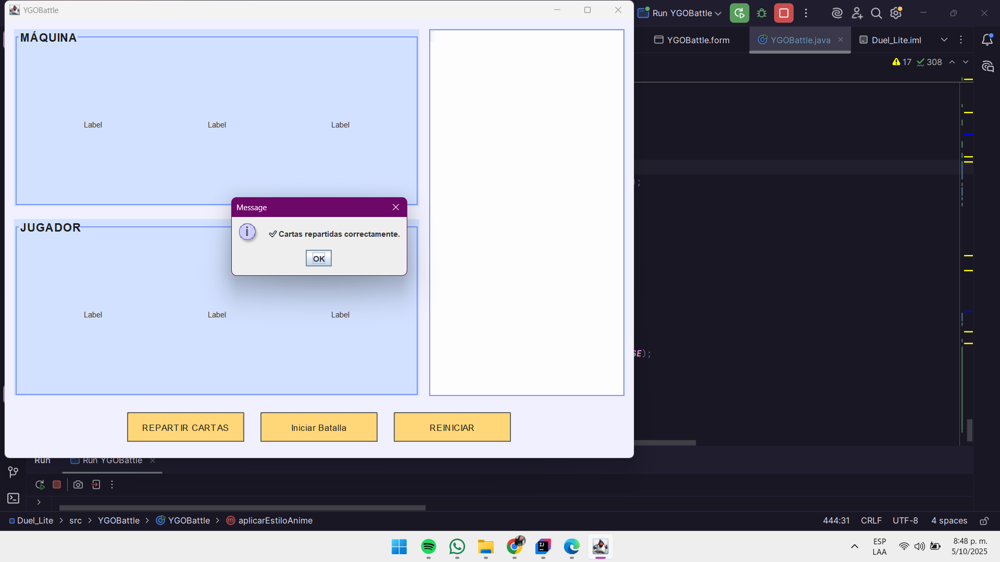
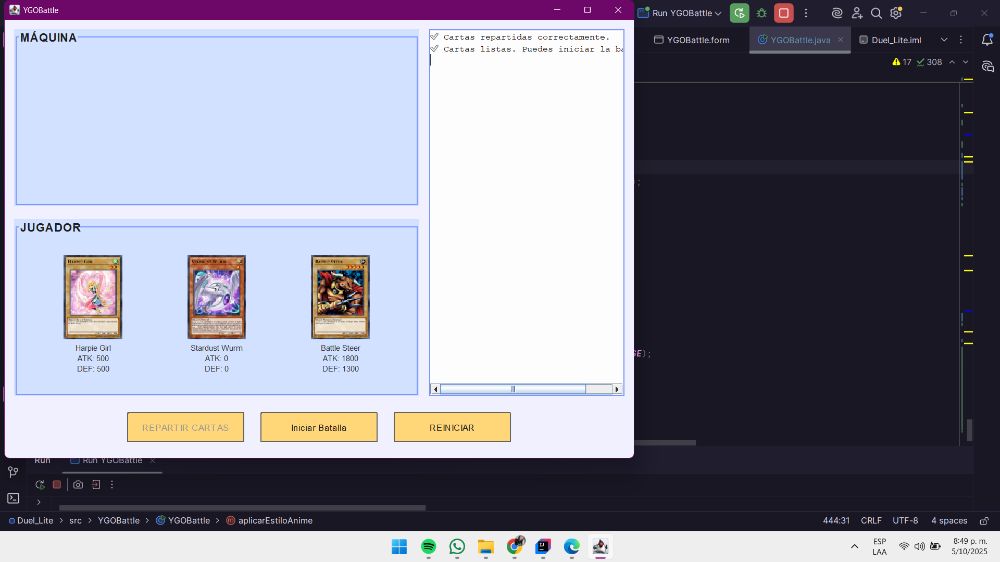
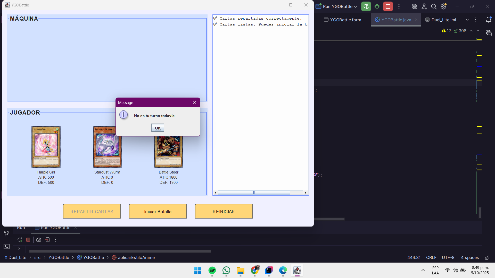
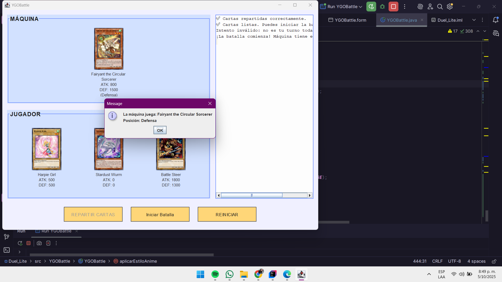
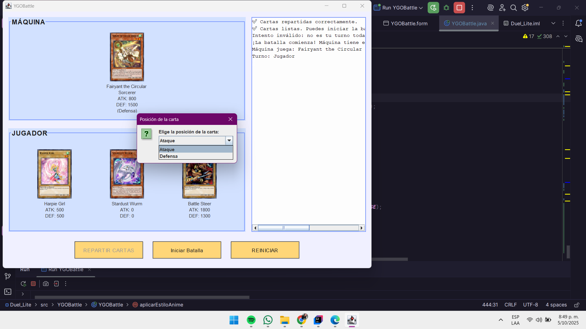
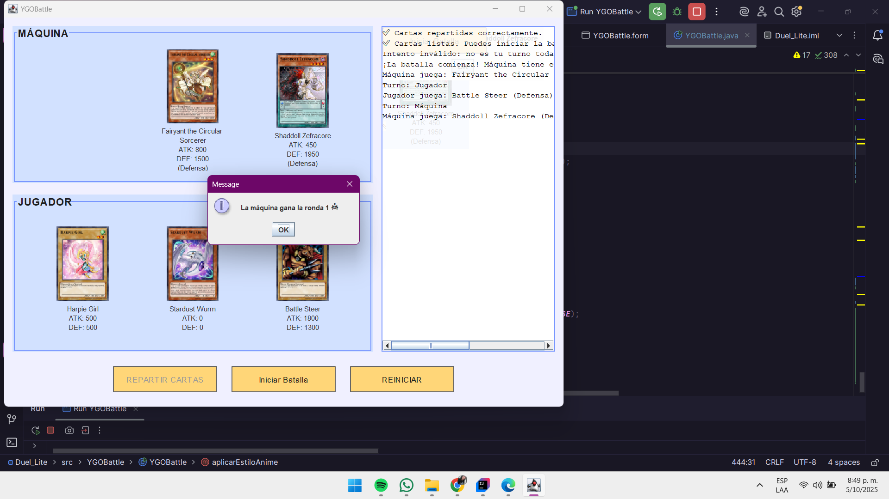

# Yu-Gi-Oh-Duel-Lite-DSIII

<div align="center">

# 🎴 **Yu-Gi-Oh! Duel Lite DSIII**
**"¡Desafía al destino y derrota a la máquina en este duelo de cartas legendarias!"**

## Objetivos
- Consumir una API REST desde Java (JSON).
- Aplicar POO con clases organizadas.
- Usar Swing para la interfaz de usuario.
- Manejar eventos con Listeners.
- Practicar trabajo en equipo con Git y GitHub.

## ⚡ **Descripción general**

**Yu-Gi-Oh! Duel Lite DSIII** es una versión ligera y didáctica del clásico juego de cartas, construida desde cero con **Java** sin frameworks pesados.  
El sistema permite a un **jugador humano** enfrentarse a la **máquina** en un duelo rápido, utilizando cartas reales obtenidas de una **API pública de Yu-Gi-Oh!**.

El objetivo fue implementar una **arquitectura limpia, asincronía con SwingWorker** y un diseño visual tipo **anime minimalista** — todo sin bloquear el hilo principal de la interfaz.

---

## 🚀 **Ejecución del proyecto**

### 🔧 Requisitos previos
- ☕ **Java 17 o superior**
- 💻 IDE recomendado: *IntelliJ IDEA*
- 🌐 Conexión a Internet (para obtener cartas de la API)

### ▶️ Pasos para ejecutar

1. Clona el repositorio:
   ```bash
   git clone https://github.com/Maryu12/Yu-Gi-Oh-Duel-Lite-DSIII.git
2. Abre el proyecto en tu IDE.
3. Verifica que el paquete APIYgo esté dentro de src/.
4. Ejecuta la clase principal: src/YGOBattle/YGOBattle.java
5. ¡Y listo! Se abrirá la ventana principal del duelo 🧠💥

## ⚔️ Mecánica del juego
| Acción                 | Descripción                                                                                              |
| ---------------------- | -------------------------------------------------------------------------------------------------------- |
| 🃏 **Repartir Cartas** | Obtiene 3 cartas aleatorias del jugador y la máquina desde la API. Solo puede hacerse una vez por duelo. |
| ⚔️ **Iniciar Batalla** | Define aleatoriamente quién inicia. Luego, cada turno se comparan valores ATK/DEF según posición.        |
| 🔁 **Reiniciar**       | Reinicia completamente el duelo y restaura el estado inicial.                                            |
| 📜 **Log de Jugadas**  | Registra todos los movimientos y resultados en tiempo real.                                              |

## 🧱 Cumplimiento de restricciones

✅ Sin uso de frameworks pesados (Spring, Retrofit, etc.)
✅ Hilo de UI no bloqueado durante las peticiones
✅ Código organizado por paquetes
✅ Comentarios descriptivos y estructura modular
✅ Interfaz fluida y funcional

Yu-Gi-Oh-Duel-Lite-DSIII/
│
├── src/
│   ├── APIYgo/
│   │   ├── Card.java
│   │   └── YgoApiClient.java
│   │
│   ├── YGOBattle/
│   │   ├── YGOBattle.java     ← Clase principal (UI + lógica)
│   │   └── YGOBattle.form     ← Diseño visual (IntelliJ)
│
├── screenshots/
│   └── ygobattle_ui.png
│
└── README.md
---

## 📸 **Galería de capturas**

<div align="center">

| 🎴 Escena | Vista previa |
|:--|:--:|
| Inicio del duelo |  |
| Cartas repartidas correctamente |  |
| Turno de la máquina 🤖 |  |
| Jugador gana una ronda 🎉 |  |
| Interfaz general anime-style |  |
| Log de jugadas en acción |  |
| Reinicio del duelo 🔁 |  |
| Detalle visual de cartas |  |
| Botones personalizados |  |
| Distribución de paneles |  |

---

✨ *Cada imagen representa un momento clave del juego, desde el reparto de cartas hasta la victoria final del jugador.*

</div>


🛠️ *Proyecto desarrollado en Java Swing para la materia de Desarrollo de Software III*
## Autores
- 👩‍💻 Duque Karen 
- 👩‍💻 Villa Maryury
- 📍 *Tuluá, Colombia*

- ✨ "Cree en el corazón de las cartas."
- 💀 — Seto Kaiba, probablemente.

</div> ```
